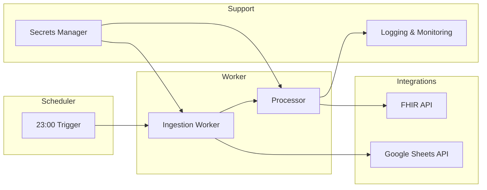
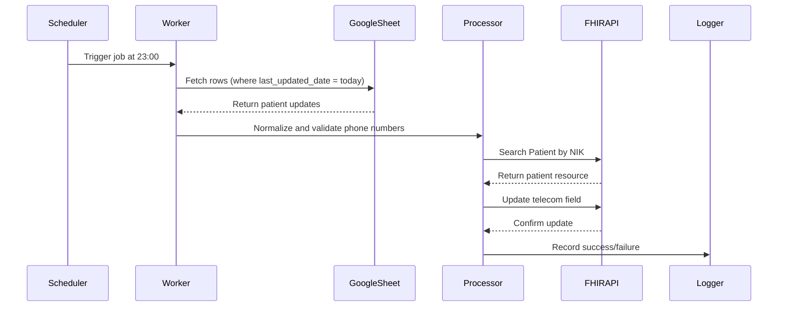

# Part B – System Design Proposal

## 1. Overview
The goal is to build a nightly sync service that updates patient phone numbers in the national FHIR server based on the daily WhatsApp update sheet.

- Sync time: every night at **23:00 Asia/Jakarta**
- Target performance: **≥20,000 patient updates within ≤30 minutes**
- Data source: Google Sheets (via service account)
- Data destination: National FHIR API (via x-api-key)

---

## 2. High-Level Architecture

### Components
- **Scheduler/Orchestrator**  
  Triggers the sync job every night at 23:00.
  
- **Ingestion Worker**  
  Reads updated rows from Google Sheets (filtered by `last_updated_date`).

- **Processor**  
  Normalizes phone numbers, validates NIK, builds FHIR-compatible updates.

- **FHIR Integration Layer**  
  Sends updates to the national FHIR API:
  - `GET Patient?identifier=...` (search by NIK)
  - `PUT /Patient/{id}` with updated telecom field

- **Persistence/Cache (optional)**  
  Stores processed rows and sync logs for recovery or auditing.

- **Observability Stack**  
  Logs, metrics (records processed, success, failures, duration), alerts.

- **Secrets Manager**  
  Securely stores Google service account credentials and API keys.

---

### Component Diagram

## 3. Data Flow (Sequence)

4. Operations View

a.Runtime / Hosting

    - Option A: Kubernetes CronJob

    - Option B: Cloud Run Job with Cloud Scheduler

b.Scaling

    - Parallel workers (batch N patients each) to reach 20k updates in <30 min

    - Retry with exponential backoff for failed requests

c.Idempotency

    - Re-running for a given date produces the same result

    - Updates overwrite old phone numbers safely

d.Secrets Management

    - Use Secret Manager / Vault for Google credentials & FHIR API key

e.Monitoring

    - Metrics: processed_count, success_count, failure_count, duration

    - Alerts on >1% failure or runtime >30 minutes

f.Failure Recovery

    - Operators can re-run job for a past date with a parameter

    - Store sync logs for reconciliation

5. Security Considerations

    - All data encrypted in transit (HTTPS/TLS).

    - Secrets never stored in code, only in secure manager.

    - Minimal IAM roles: service account has read-only Google Sheets, write access to FHIR API.

6. Future Improvements

    - Add deduplication for multiple updates per day.

    - Build operator dashboard with retry/replay buttons.

    - Support delta-based sync instead of full daily run.

    Add automated phone number validation against WhatsApp API (optional).